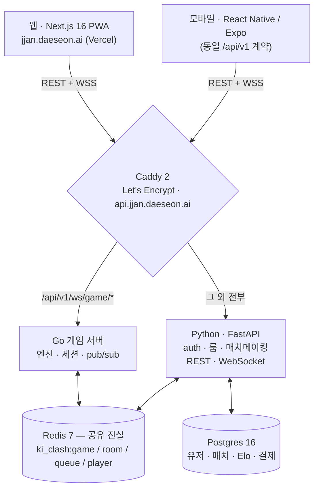

<div align="center">

# JJAN! · 짠 · 기싸움

### 실시간 1:1 리빌 듀얼 — 상대를 읽고, 기를 모으고, 먼저 친다.

<sub>FastAPI + **두 개의 병렬 런타임(Python + Go)** 이 하나의 Redis 게임 상태를 공유 · Next.js 16 PWA · 같은 백엔드를 쓰는 풀 React Native(Expo) 앱 · 4글자 룸 코드 기반 PvP · 6 파이터 시그니처 궁극기 · AI 스프라이트 파이프라인 · GitHub Actions CI · k6 부하 스위트</sub>

<br>

[](https://jjan.daeseon.ai)
&nbsp;
[](https://github.com/Daeseon-AI-Factory/ki-clash/actions/workflows/ci.yml)

[**🌐 jjan.daeseon.ai**](https://jjan.daeseon.ai) · [GitHub repo](https://github.com/Daeseon-AI-Factory/ki-clash) · [English](./README.md) · **한국어**


</div>


> **TL;DR.** 한국 학교 운동장의 *기싸움* 을 모티프로 한 실시간 1:1 PvP 게임. 매 턴 두 플레이어가 **5가지 액션**(차지 / 블록 / 어택 / 기 버스트 / 텔레포트) 중 하나를 동시에 비공개로 고르면, 두 수가 같은 순간에 공개되고 결과 행렬이 누가 적중했는지 결정한다. **3판 2선승제.** 진짜 핵심은 게임이 아니라 **시스템 엔지니어링**이다 — 두 백엔드 런타임(Python + Go)이 *같은* Redis 게임 상태를 공유해서 어느 쪽이든 실시간 WebSocket을 서빙할 수 있고, 분산 상태에서 터지는 PvP 동시성 버그 4개를 실제로 찾아 고치고 회귀 테스트로 박았다. Next.js PWA **와** 풀 React Native 앱이 하나의 백엔드 계약 위에서 돌고, 6-job CI 게이트와 k6 부하 스위트로 검증한다. 혼자 ~4.3개월 / **137 커밋**, 모든 트레이드오프를 2,500줄 결정 로그로 증명. *(레포 코드네임은 `ki-clash`, Redis 네임스페이스는 `ki_clash:*` 유지 — 라이브 제품 브랜드는 **JJAN!**.)*

---

## 화면

<table>
<tr>
<td width="33%"></td>
<td width="33%"></td>
<td width="33%"></td>
</tr>
<tr>
<td align="center"><sub><b>플레이 메뉴</b> — AI 3티어(랜덤 / 패턴 읽기 / 게임이론) + PvP · 튜토리얼 · 랭크.</sub></td>
<td align="center"><sub><b>파이터 선택</b> — 6 파이터(Kael · Selene · Blaze · Yuki · Atlas · Rosa).</sub></td>
<td align="center"><sub><b>배틀</b> — 5초 리빌 타이머, 줄어들기 전에 선택.</sub></td>
</tr>
<tr>
<td width="33%"></td>
<td width="33%"></td>
<td width="33%"></td>
</tr>
<tr>
<td align="center"><sub><b>기 이코노미</b> — 어택 / 기 버스트 / 텔레포트는 모은 기를 소모, 차지로 충전.</sub></td>
<td align="center"><sub><b>라운드 종료</b> — 3판 2선승, 자동 진행.</sub></td>
<td align="center"><sub><b>매치 종료</b> — 캐릭터별 피날레 → VICTORY / DEFEAT → 스탯 + Play Again.</sub></td>
</tr>
</table>

<details>
<summary><b>더 보기</b> (배틀 액션바 · 승리 연출)</summary>

|  |  |
|---|---|
| **액션바** — 카운트다운 아래에서 선택, 타임아웃 시 자동 `charge`. | **승리 연출** — 3단 컨페티, 크로마틱 분리, 스크린 셰이크. |

</details>

---

## 이 프로젝트가 보여주는 것

> *바쁜 리뷰어용 — 이 레포가 실제로 증명하는 엔지니어링.*

- **🔀 두 개의 병렬 서버 런타임, 하나의 진실.** Python과 Go가 게임 상태를 같은 Redis JSON 블롭(`ki_clash:game:{id}`)에 읽고 쓴다. 어느 쪽이든 특정 WebSocket 연결을 서빙 가능 — load → `WATCH`/`MULTI`/`EXEC` 클로저 안에서 mutate → per-player Redis 채널로 publish 라는 정석 패턴을 두 런타임에 그대로 포팅했다. **E2E 검증됨:** Python REST API로 룸을 만들고, 두 플레이어가 Go WebSocket으로 접속, 둘 다 `charge` 제출, 둘 다 올바르게 개인화된 `turn_result` 봉투와 정확한 기 계산을 수신(`go-server/test_e2e.py`, 통과).
- **🛡️ 분산 상태 하드닝 — 버그를 문서로 남김.** 인프로세스 시뮬레이터로 찾아 고친 실제 PvP 동시성 버그 4개(첫 접속 시 잘못 뜨는 `opponent_reconnected` · `start()`가 두 곳에서 불려 중복되던 `waiting_for_action` · 메시지 순서 · `turn_number` 없는 `action_confirmed`). 모두 [`docs/troubleshooting.md`](./docs/troubleshooting.md) 에 증상 / 원인 / 커밋 해시로 정리하고, 회귀 테스트 클래스(`tests/integration/test_pvp_flow.py::TestPhase3Regressions`)로 박아 재발 차단.
- **📱 하나의 백엔드, 두 프론트엔드, 프로토콜 중복 0.** 풀 React Native(Expo) 앱(`mobile/`, ~6.9 KLOC, 7개 라우팅 화면)이 Next.js 웹과 **완전히 동일한** `/api/v1` REST + WebSocket 계약을 사용. 웹과 모바일이 어긋나는 걸 막기 위한 전용 CI job(`check-online-parity.mjs`)까지 둠.
- **🧠 19개의 문서화된 설계 결정.** 엔지니어링 로그의 `## Engineering Decision Reference` 가 **DR-1 ~ DR-19** — 각각 고려했다 버린 대안을 적은 100–300줄 항목: 백엔드 언어(Python vs Spring vs Go), 스테이트리스 워커 + Redis-as-truth, per-player pub/sub 토폴로지, 턴 제출 낙관적 동시성, JWT 복구 전략, `xfail` 정책 등.
- **🎨 저작권 + 투명도 검수를 통과하는 AI 스프라이트 파이프라인.** 36개의 파이터 PNG(6 캐릭터 × 6 포즈)를 **Pollinations/flux** 로 생성한 뒤 **rembg(U²-Net)** 로 생성기가 남긴 흰 배경 제거. 렌더러가 포즈별 PNG를 고르고, 포즈 PNG가 로드되면 CSS "퍼펫" 회전이 scale-only로 떨어져서 `ko.png`(이미 누워있음)가 이중 회전되지 않음. 특정 라이선스 캐릭터에 너무 가까웠던 스프라이트는 이미 1회 재생성 완료.
- **🧱 혼자 · ~4.3개월 · 137 커밋 · 그걸 증명하는 결정 로그.** 규율 있는 anti-fabrication 글더미: [`docs/engineering-log.md`](./docs/engineering-log.md)(2,512줄) + [`docs/troubleshooting.md`](./docs/troubleshooting.md) — 인용된 커밋 해시는 전부 실제, "Symptom"은 전부 실제 관측된 메시지, 모든 결정은 기각한 대안을 명시.

---

## 기술 스택

| 레이어 | 선택 & 역할 |
|---|---|
| **플랫폼 서버** | **Python 3.11 / FastAPI**(async) — auth · 매치메이킹 · 룸 · 프로필 · 결제 · REST · 현재 *권위적인* WebSocket. 5,671 LOC / 62 파일. |
| **게임 서버** | **Go 1.23 / gorilla/websocket** — 전체 PvP 게임 루프 포팅(엔진 + 세션 + Redis `WATCH/MULTI/EXEC` + per-player pub/sub + 하트비트). 2,082 LOC / 11 파일. Python과 같은 JWT 시크릿·같은 Redis 네임스페이스, 독립 Docker 서비스. |
| **웹** | **Next.js 16**(App Router) · React 19 · TypeScript 5 · Tailwind v4 · `framer-motion` · `canvas-confetti`. 설치형 **PWA**, edge 렌더 1200×630 OG 공유 카드. ~14,000 LOC / 85 파일. |
| **모바일** | **React Native / Expo**(New Architecture, RN 0.81 / Reanimated 4 / Skia) — 7개 라우팅 화면(game · pvp · ranked · history · invite · tutorial), EAS iOS 빌드/제출 프로필. ~6.9 KLOC. 웹과 같은 백엔드 계약. |
| **DB** | **PostgreSQL 16** + SQLAlchemy 2.0 async — 유저 · 매치 · 랭크 Elo · 결제. |
| **상태 저장소** | **Redis 7** — 게임 세션 JSON(`ki_clash:game:{id}`, 1시간 TTL) · 매치메이킹 큐(ZSET) · per-player pub/sub 채널 · 룸 코드 · 레이트리밋 카운터. |
| **인증** | JWT(HS256), **게스트 우선**: 이메일 없이 즉시 플레이, 나중에 업그레이드. 프론트가 만료 토큰을 자동 복구(401 → 게스트 재발급 → 1회 재시도). |
| **결제** | 두 프로바이더를 하나의 서비스 뒤에 — **Stripe**(광고 제거 패스) + **Lemon Squeezy**(Founder Pass), 둘 다 서명 검증 웹훅 + 체크아웃 퍼널 애널리틱스. |
| **AI 상대** | 순수 Python **결정론적** 전략 — 게임플레이 경로에 LLM 없음("결정론적 백본" 원칙). 이지 / 패턴 매칭 / 게임이론 혼합 전략. |
| **관측성** | 구조화 JSON 로그 + **양쪽 런타임** 모두에 Prometheus `/metrics`(커스텀 게임 메트릭: 매치 수, 라이브 PvP 게이지, 턴 해결 레이턴시 히스토그램) + opt-in Sentry. |
| **그로스** | 1st-party 애널리틱스 퍼널(`sendBeacon`, ~20개 타입드 이벤트, 검증된 ingest 라우트) + 코드로 정의한 프로모 시스템(타입드 UTM 캠페인, 로깅 `/go/<slug>` 리다이렉터, 생성형 포스팅 캘린더). |
| **리버스 프록시** | **Caddy 2** — 자동 Let's Encrypt SSL, `/api/v1/ws/game/*` → Go, 나머지 → Python 라우팅. |
| **CI/CD** | **GitHub Actions** — 매 push/PR마다 6-job 게이트: 실제 Postgres+Redis 컨테이너 상대 `pytest` · `go test` · 웹 `tsc`+build · Expo iOS 번들 export · 웹/모바일 패리티 · 마케팅 링크 체크. |
| **부하/성능** | **k6** 스위트(`load/`) — smoke · REST 램프 · 라이브 게임을 미리 스폰하고 핑하는 소켓을 잡는 WebSocket 용량 테스트, SLO 임계치를 인코드해 위반 시 실패. |
| **테스트** | **Python 151개** 테스트 함수(8개 모듈) + **Go 13개** 유닛 테스트(엔진 cell-by-cell + 시점 반전). |

---

## 아키텍처

**한 매치, 두 런타임, 하나의 Redis.** 핫패스 WebSocket 게임플레이를 클라이언트가 눈치채지 못한 채 Python이든 Go든 서빙할 수 있다 — 둘 다 같은 JSON 봉투를 말하고, 같은 Redis 키를 쓰고, 같은 JWT 시크릿을 쓴다. Caddy가 단일 스위치.



**핵심 결정**(전체 근거는 [`docs/engineering-log.md`](./docs/engineering-log.md) Part 2의 DR-N):

- **스테이트리스 워커, Redis-as-truth (DR-15).** 게임별 상태는 Redis에만 존재 — 어느 런타임의 어느 워커든 JSON 블롭을 로드해 게임을 서빙. 열린 `WebSocket` 외에는 프로세스 메모리에 아무것도 안 잡음. 이게 Python + Go 병행을 안전하게 만드는 핵심.
- **낙관적 동시성, 비관적 락 아님 (DR-14).** 같은 sub-ms 윈도우에 제출하는 두 플레이어는 3회 재시도 예산의 Redis `WATCH`/`MULTI`/`EXEC` 를 통과. `watch_and_update`(Python)와 `Store.watchAndUpdate`(Go)가 동일 패턴 구현.
- **Per-player pub/sub 채널 (DR-13).** 플레이어에게 push할 때 소켓을 들고 있으면 로컬로, 아니면 `ki_clash:player:{id}` 에 `PUBLISH` → 연결을 잡은 인스턴스가 릴레이. 그래서 Python이 Go가 서빙 중인 플레이어에게 push 가능, 반대도.
- **지연/조건부 통합 (DR-9).** Sentry · Prometheus · Stripe · Lemon Squeezy — 모든 외부 통합이 env var 없으면 no-op. 로컬 개발에 계정 0개.

---

## 멀티플레이어 정합성

1:1 턴제 PvP를 어렵게 만드는 5가지와 그 처리 방식.

| 관심사 | 구현 |
|---|---|
| **동시 액션** | 2-봉투 패턴. `p1_action` / `p2_action` 을 따로 저장하고 둘 다 있을 때만 `resolveTurn`. 원자적 Redis 업데이트가 같은 `EXEC` 안에서 두 번째 제출을 **저장**하고 두 필드를 **클리어** — 하나만 세팅된 채 stale 워커가 읽는 윈도우가 없음. |
| **같은 ms 동시 제출** | 3회 재시도 예산의 `WATCH`/`MULTI`/`EXEC`. 인프로세스 PvP 시뮬레이터(`scripts/pvp_simulator.py`)와 매치메이킹 서비스 테스트로 검증. |
| **클라-서버 메시지 순서** | `action_confirmed` 봉투가 적용 대상 `turn_number` 를 명시 → 클라가 도착 순서가 아니라 턴으로 상관관계 매칭. *(Phase 3 Bug 4 — 턴5의 stale confirm이 진행 중인 턴6 제출의 확인으로 오인될 수 있었음.)* |
| **연결 끊김 / 재접속** | 끊긴 플레이어당 30초 몰수 타이머; 발화 시 **Redis 재독** — `connected_players` 가 *어느* 워커(Go/Python)로든 재접속을 보이면 몰수는 no-op. 두 런타임이 같은 set 갱신. |
| **첫 접속 vs 재접속** | 단일 `handle_connect(game_id, player_id)` 가 원자 업데이트 안에서 결정: id가 이미 `connected_players` 에 있으면 재접속(상대 알림 + 상태 재전송), 없으면 추가하고 조용히 진행. 첫 접속에 `opponent_reconnected` 가 잘못 뜨던 Phase 3 Bug 1 제거. |

---

## 게임 엔진 & API

**룰**(`app/core/game_engine/types.py`): `KI_CAP = 10` · `TURN_LIMIT = 20` · `ROUNDS_TO_WIN = 2`(3판 2선) · `TURN_TIME_LIMIT_SECONDS = 5`(타임아웃 시 자동 `charge`).

**결과 행렬**(`app/core/game_engine/outcome_matrix.py`): `(p1_action, p2_action) → outcome` 을 매핑하는 손튜닝 **5×5** 테이블. 예: `Attack ⨯ Charge → P1 승`(차지를 읽음) · `Ki Burst ⨯ Block → P1 승`(버스트가 블록 관통) · `Ki Burst ⨯ Teleport → 회피` · `Attack ⨯ Attack → 클래시`. `tests/core/test_game_engine.py` **와** `go-server/engine_test.go` 에서 cell-by-cell 테스트 — 두 런타임이 동일하게 해결.

**API 표면** — 8개 모듈에 걸쳐 **HTTP 라우트 23개 + WebSocket 엔드포인트 2개**(`app/api/v1/endpoints/`):

```
Auth        POST /api/v1/auth/guest · /upgrade · /refresh
Players     GET  /api/v1/players/me · /me/matches
Games(AI)   POST /api/v1/games/ai · GET /games/{id} · POST /games/{id}/action
Rooms(PvP)  POST /api/v1/rooms · GET/POST/PUT /rooms/{code}[/join /character /ready /start /leave]
Ranked      GET  /api/v1/ranked/leaderboard · /me
Purchases   POST /api/v1/purchases/checkout/* · GET /ad-free-status · POST /webhook (서명 검증)
WebSocket        /api/v1/ws/matchmaking?token=…   ·   /api/v1/ws/game/{game_id}?token=…
Ops         GET  /health · /metrics (Prometheus)
```

---

## 성능 · 테스트 · CI

- **CI 게이트(GitHub Actions, 6 job, 매 push/PR).** `python-test` 가 실제 **Postgres 16 + Redis 7** 서비스 컨테이너를 띄우고 `alembic upgrade head` 후 `pytest`. `go-test` 는 `go test ./...`. `web-build` 는 `tsc --noEmit` + `next build`. `mobile-check` 는 타입체크 + 실제 `expo export --platform ios`. 나머지 2개 job은 웹↔모바일 패리티와 마케팅 링크 검사. [](https://github.com/Daeseon-AI-Factory/ki-clash/actions/workflows/ci.yml)
- **테스트.** Python 테스트 함수 151개(엔진 · 게임스토어 · 매치메이킹 서비스 · AI 상대 · ws-manager pub/sub · 로깅 · 관측성 · 통합 PvP 플로우) + Go 유닛 테스트 13개(엔진 행렬 + 시점 반전 헬퍼).
- **부하/성능(k6, `load/`).** `smoke.js`(1 VU 풀 플로우) · `rest_load.js`(램핑 VU, vs-AI 70% / Room-PvP 30%) · `ws_load.js`(REST로 N개 라이브 게임 미리 스폰, VU별로 핑 소켓 유지). SLO 임계치(`http_req_failed < 2%`, `p95 < 1500ms`, `ws_connecting p95 < 3000ms`)를 인코드해 위반 시 non-zero exit. [`load/README.md`](./load/README.md) 에 단일 `t3.micro` 안전 주의사항과 결과 해석법 정리(지어낸 수치 없음).

---

## 로컬 실행

**외부 계정 불필요** — Stripe·Sentry·AWS·도메인 전부 없이. 모든 통합이 env var 없으면 graceful no-op.

```bash
git clone https://github.com/Daeseon-AI-Factory/ki-clash.git
cd ki-clash
docker compose up -d                       # Postgres + Redis + Python API on :8000
docker compose exec api alembic upgrade head

# 웹
cd web && npm install && npm run dev        # http://localhost:3000

# 확인
curl http://localhost:8000/health           # → {"status":"ok"}
open http://localhost:3000                   # AI 매치 플레이
```

**로컬 PvP:** 브라우저 2개(하나는 시크릿) → 둘 다 `/pvp` → 한쪽이 **Create Room**, 4글자 코드 복사 → 다른 쪽이 **Join Room**, 코드 입력 → 둘 다 파이터 선택 → 둘 다 ready → 매치 시작.

**테스트 실행:**

```bash
docker compose exec api python -m pytest     # Python 테스트 함수 151개
cd go-server && go test ./...                # Go 테스트 함수 13개
```

---

## 배포

| 서비스 | 상태 |
|---|---|
| **웹** — `https://jjan.daeseon.ai`(Vercel · Next.js) | ✅ 라이브 |
| **백엔드** — `https://api.jjan.daeseon.ai`(EC2 · Python + Go + Postgres + Redis + Caddy, `docker-compose.prod.yml`) | 🟡 컨테이너화 + 배포 런북 커밋 완료 |

프로덕션 토폴로지(단일 인스턴스, 프리티어에서 동시 매치 ~100; 확장은 DR-15의 스테이트리스로 수평 확장):

```
EC2 t3.micro (Ubuntu 24.04) → docker-compose.prod.yml
  ├── caddy   (80/443 — Let's Encrypt 자동 SSL, 리버스 프록시)
  ├── api     (Python FastAPI, uvicorn)
  ├── game    (Go WebSocket 게이트웨이)
  ├── db      (Postgres 16 — pgdata 볼륨)
  └── redis   (Redis 7 — AOF 영속화)
```

단계별 가이드(보안그룹·Elastic IP·DNS·시크릿 생성·Caddy 자동 인증서)는 [`deploy/aws-ec2/`](./deploy/aws-ec2/). **Vercel 주의:** Next.js 앱이 `web/` 에 있으므로 Vercel 프로젝트에서 **Root Directory → `web`** 설정.

---

## 엔지니어링 로그

- [`docs/engineering-log.md`](./docs/engineering-log.md) — **2,512줄.** *Part 0* = "RESUME HERE" 현재 상태 스냅샷 · *Part 1* = 시간순 빌드 스토리 · *Part 2* = **Engineering Decision Reference**, DR-1 → DR-19, 각 항목이 대안·기각 경로·재사용 메타패턴을 담은 100–300줄 트레이드오프 분석.
- [`docs/troubleshooting.md`](./docs/troubleshooting.md) — 문제 인덱스형(18개 항목). 항목 포맷: **Symptom / Cause / Fix / Commit / Pattern**. PvP 버그 4개, JWT 401 stale-token 루프, Pollinations 레이트리밋 충돌, Lua `cjson` 빈 배열 이슈(근거와 함께 보류) 등.
- [`docs/spec.md`](./docs/spec.md) · [`docs/architecture.md`](./docs/architecture.md) · [`docs/multiplayer-networking.md`](./docs/multiplayer-networking.md) — 제품 스펙 + 보조 설계.

```
$ git log --oneline | wc -l
   137
$ git log --reverse --format='%ai' | head -1   # 첫 커밋
2026-02-12 16:07:43 +0900
$ git log -1 --format='%ai'                     # 최신(작성 시점)
2026-06-21 21:20:14 -0400
```

---

## 정직한 한계

> 솔직하게 — 경계를 아는 것도 엔지니어링의 일부.

- **아직 React 컴포넌트 유닛 테스트 없음.** Python(151) · Go(13) 스위트는 매 push마다 CI에서 돌고 k6 스위트가 REST + WebSocket 핫패스를 커버하지만, 웹/모바일 컴포넌트는 여전히 수동 + CI 타입체크/빌드로 검증. 컴포넌트 테스트가 다음 투자 1순위.
- **Go 런타임은 연결됨, 플랫폼은 Python.** 커밋된 `Caddyfile` 이 `/api/v1/ws/game/*` 를 Go 서비스로 라우팅하고 E2E 테스트가 실제 Python 발급 세션을 올바르게 서빙함을 확인 — 그 외 전부(auth·룸·매치메이킹·REST)는 Python이 권위적.
- **Lua 원자적 제출 보류.** `go-server/submit_action.lua` 를 `WATCH`/`MULTI`/`EXEC` 의 단일 왕복 대안으로 작성했으나, Redis `cjson` 이 빈 배열을 객체로 인코딩 → Pydantic strict-mode가 라운드트립에서 거부. `WATCH`/`MULTI`/`EXEC`(현재 경합에서 충분) 로 되돌리고 인라인 문서화.
- **일부 스프라이트가 라이선스 캐릭터에 가까움.** 가장 노골적인 케이스는 1회 재생성 완료. 상업 출시의 정직한 길은 Adobe Firefly(법적 면책) 또는 외주 작가 — `/fighters/<id>/<pose>.png` 레이아웃이 코드 변경 0으로 교체 가능하게 함.
- **크로스 인스턴스 연결 끊김 감지** 는 Redis 기반·코드 리뷰 완료지만, 실제 멀티 인스턴스 배포 상대 스트레스 테스트는 아직.

---

## 프로젝트 구조

```
app/                       FastAPI 백엔드 (Python 3.11, async)
  api/v1/endpoints/        auth · games · players · ranked · purchases · rooms · ws
  core/                    auth(JWT+게스트) · game_engine(types/matrix/engine)
                           ai_opponent · game_store(WATCH/MULTI/EXEC) · room_store
                           ws_manager(per-player pub/sub) · payment · observability
  services/                matchmaking · game · ranked · payment · player
  models/  schemas/        SQLAlchemy + Pydantic
go-server/                 Go 1.23 풀 게임루프 런타임 (engine/session/store/pubsub)
  engine_test.go           유닛 13개 · test_e2e.py  E2E (Python 룸 → Go WS)
web/                       Next.js 16 PWA — arena/finale/room 컴포넌트, 훅, lib
  public/fighters/<id>/{idle,windup,impact,hit,ko,victory}.png   ← 36 PNG
mobile/                    React Native / Expo 앱 — 같은 백엔드 위 7개 화면
load/                      k6 — smoke · rest_load · ws_load
docs/                      engineering-log · troubleshooting · spec · screenshots/
deploy/aws-ec2/            QUICKSTART · 런북 · .env.prod.example
.github/workflows/ci.yml   6-job CI 게이트
docker-compose{,.prod}.yml dev: db+redis+api · prod: + game(Go) + caddy
```

---

<div align="center">

**[JJAN! · 짠 · 기싸움](https://jjan.daeseon.ai)** — 상대를 읽고, 기를 모으고, 먼저 친다.

<sub>Daeseon(Jason) Yoo 단독 제작 · [github.com/Daeseon-AI-Factory/ki-clash](https://github.com/Daeseon-AI-Factory/ki-clash) · [English README](./README.md)</sub>

</div>
