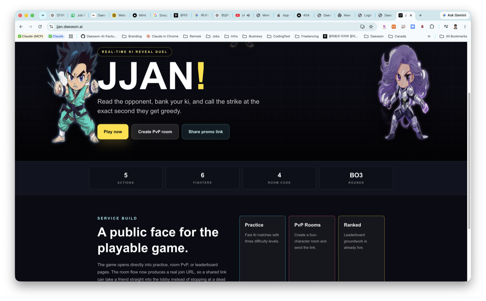
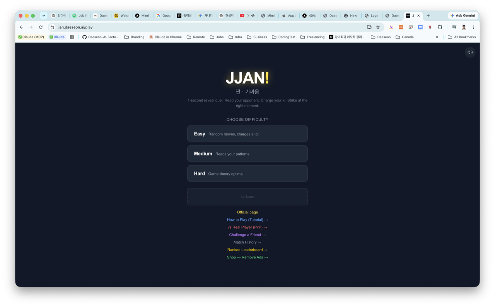
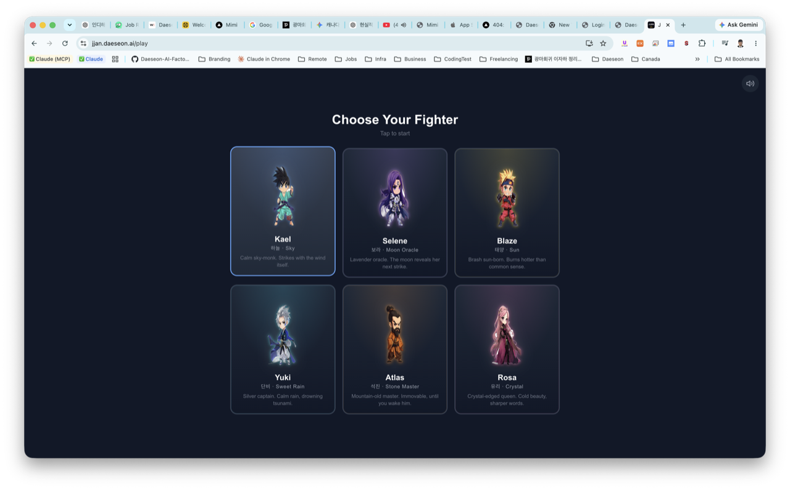
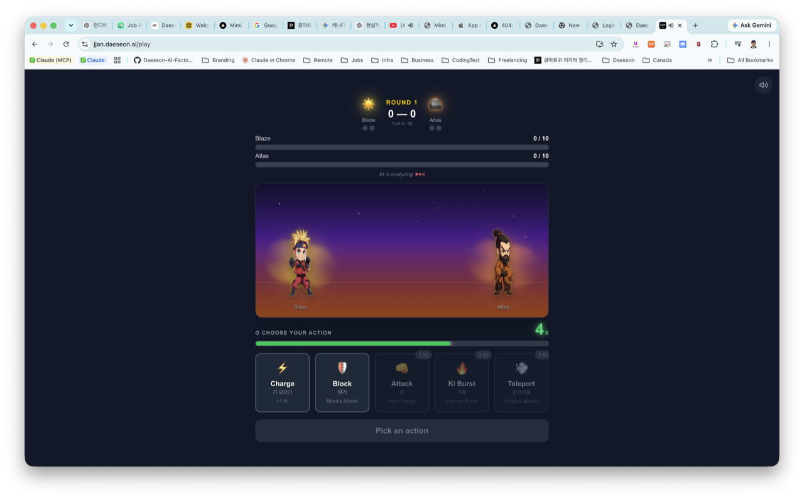
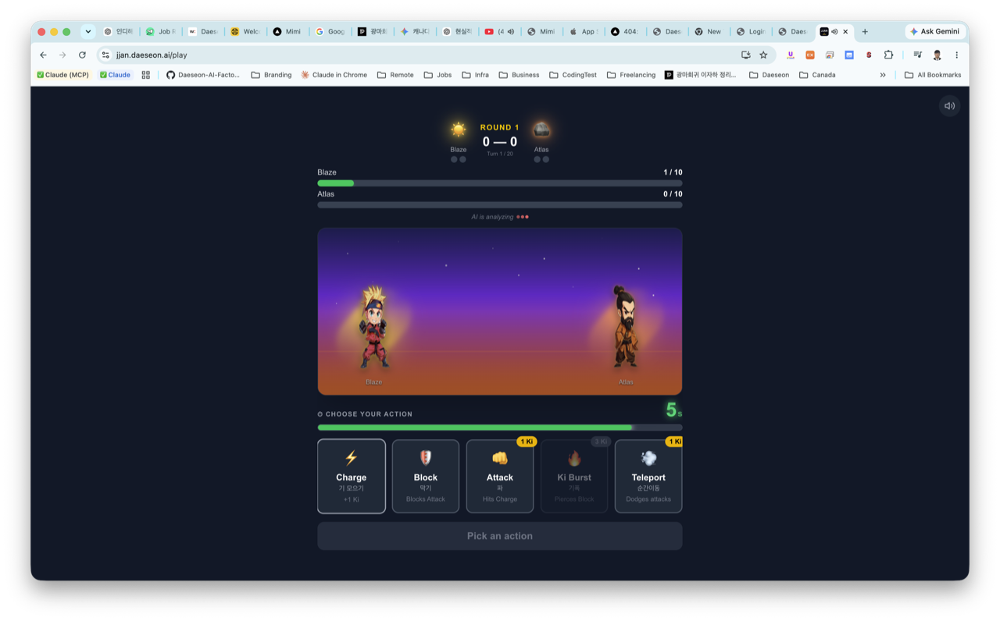
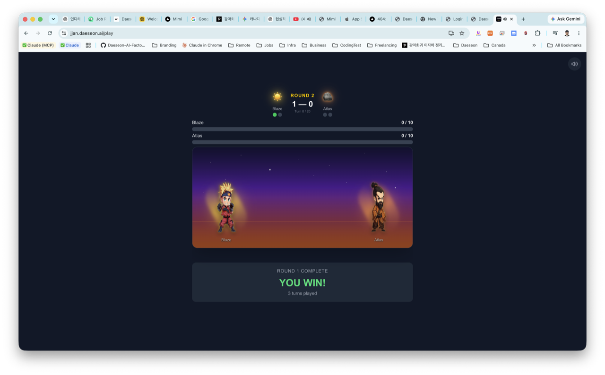
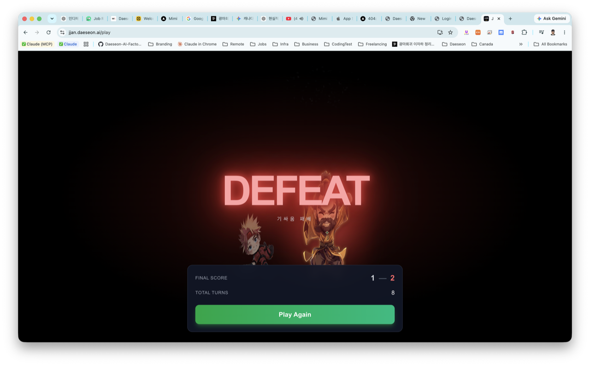
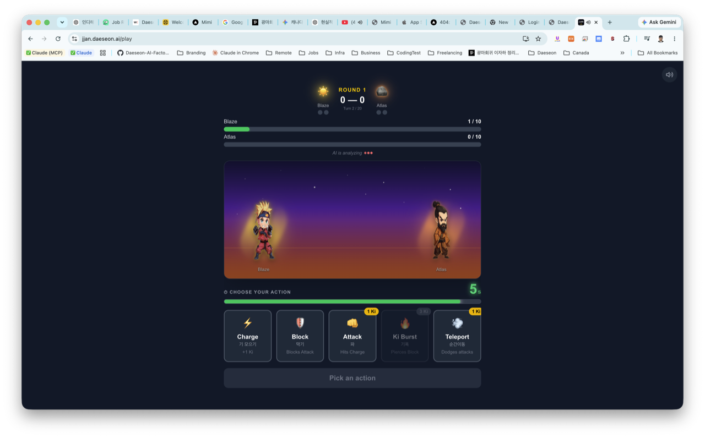
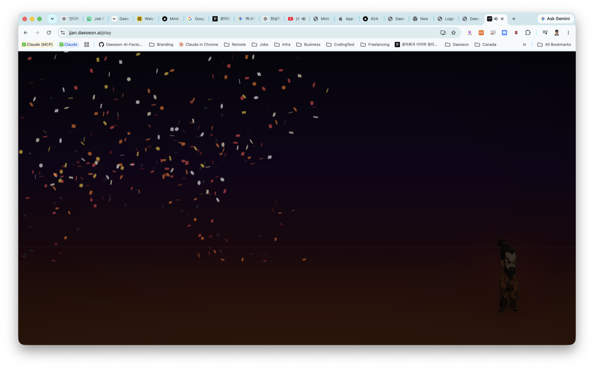
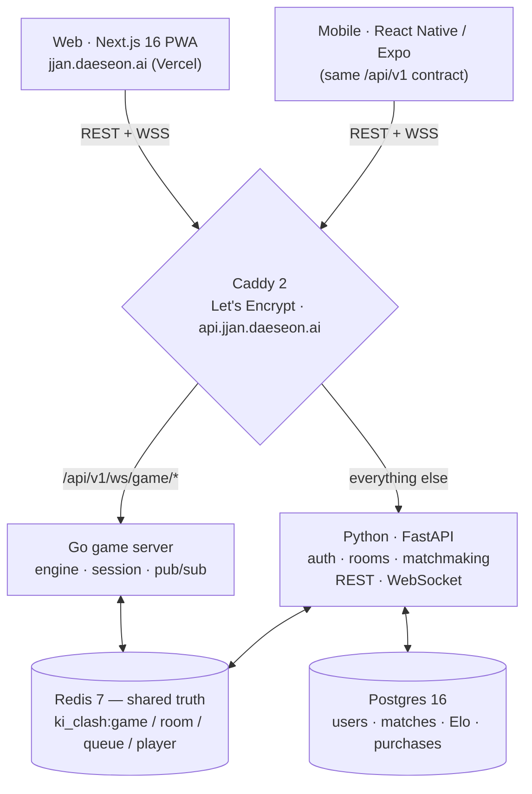

<div align="center">

# JJAN! · 짠 · 기싸움

### Real-time 1v1 reveal duel — read your opponent, charge your ki, strike first.

<sub>FastAPI + **two parallel runtimes (Python + Go)** sharing one Redis-backed game state · Next.js 16 PWA · full React Native (Expo) app on the same backend · room-based PvP with Tekken-style 4-character codes · 6 fighters with signature ultimates · AI sprite pipeline · GitHub Actions CI · k6 load suite</sub>

<br>

[](https://jjan.daeseon.ai)
&nbsp;
[](https://github.com/Daeseon-AI-Factory/ki-clash/actions/workflows/ci.yml)

[**🌐 jjan.daeseon.ai**](https://jjan.daeseon.ai) · [GitHub repo](https://github.com/Daeseon-AI-Factory/ki-clash) · **English** · [한국어](./README.ko.md)


</div>



> **TL;DR.** A real-time 1v1 PvP game based on the Korean schoolyard *기싸움* ("ki-battle"). Each turn, both players secretly pick one of **5 actions** — Charge / Block / Attack / Ki Burst / Teleport — then both moves reveal at the same instant and an outcome matrix decides who landed it. First to win **2 of 3 rounds** takes the match. The interesting part isn't the game, it's the **systems work**: two backend runtimes (Python + Go) share the *same* Redis game state so either can serve a live WebSocket; four real distributed-state PvP bugs were found, fixed, and pinned with regression tests; the whole thing ships as a Next.js PWA **and** a full React Native app on one backend contract, gated by a 6-job CI pipeline and probed with a k6 load suite. Built solo over ~4.3 months / **137 commits**, with a 2,500-line decision log to prove every trade-off. *(Repo codename stays `ki-clash`; Redis namespace stays `ki_clash:*` — the live product brand is **JJAN!**.)*

---

## See it

<table>
<tr>
<td width="33%"></td>
<td width="33%"></td>
<td width="33%"></td>
</tr>
<tr>
<td align="center"><sub><b>Play menu</b> — 3 AI tiers (easy / pattern-reading / game-theory) + PvP, tutorial, ranked.</sub></td>
<td align="center"><sub><b>Fighter select</b> — 6 fighters (Kael · Selene · Blaze · Yuki · Atlas · Rosa).</sub></td>
<td align="center"><sub><b>Battle</b> — 5-second reveal timer, pick before it drains.</sub></td>
</tr>
<tr>
<td width="33%"></td>
<td width="33%"></td>
<td width="33%"></td>
</tr>
<tr>
<td align="center"><sub><b>Ki economy</b> — Attack / Ki Burst / Teleport cost banked ki; Charge builds it.</sub></td>
<td align="center"><sub><b>Round end</b> — best of 3, auto-advance.</sub></td>
<td align="center"><sub><b>Match end</b> — character-specific finale → VICTORY / DEFEAT → stats + Play Again.</sub></td>
</tr>
</table>

<details>
<summary><b>More frames</b> (battle action bar · victory FX)</summary>

|  |  |
|---|---|
| **Action bar** — choose under the countdown; auto-`charge` on timeout. | **Victory FX** — 3-wave confetti, chromatic split, screen-shake. |

</details>

---

## Why this is worth a look

> *For reviewers in a hurry — the engineering this repo actually demonstrates.*

- **🔀 Two parallel server runtimes, one shared truth.** Python and Go both read/write the same Redis JSON blob (`ki_clash:game:{id}`) for game state. Either can serve a given WebSocket connection; the canonical pattern — load → mutate inside a `WATCH`/`MULTI`/`EXEC` closure → publish to per-player Redis channels — is ported across both runtimes. **End-to-end verified:** a room spawned via the Python REST API, both players connected over Go's WebSocket, both submit `charge`, both receive correctly-personalized `turn_result` envelopes with the right ki accounting (`go-server/test_e2e.py`, passes).
- **🛡️ Distributed-state hardening, with the bugs documented.** Four real PvP-concurrency bugs found by an in-process simulator and fixed (spurious `opponent_reconnected` on first connect · duplicate `waiting_for_action` when `start()` was called from two places · message ordering · `action_confirmed` missing `turn_number`). All four are in [`docs/troubleshooting.md`](./docs/troubleshooting.md) with symptom / cause / commit hash, and pinned by a regression test class (`tests/integration/test_pvp_flow.py::TestPhase3Regressions`) so they can't come back.
- **📱 One backend, two front-ends, zero protocol duplication.** A full React Native (Expo) app (`mobile/`, ~6.9 KLOC, 7 routed screens) talks to the **exact same** `/api/v1` REST + WebSocket contract as the Next.js web client. A dedicated CI job (`check-online-parity.mjs`) exists specifically to stop web and mobile from drifting apart.
- **🧠 19 written design decisions.** The engineering log's `## Engineering Decision Reference` carries **DR-1 through DR-19** — each a 100–300-line entry naming the alternatives considered and rejected: backend language (Python vs Spring vs Go), stateless workers + Redis-as-truth, per-player pub/sub topology, optimistic concurrency for turn submission, JWT recovery strategy, the `xfail` policy, and more.
- **🎨 An AI sprite pipeline that survives copyright + transparency review.** 36 fighter PNGs (6 characters × 6 poses) generated through **Pollinations/flux**, then re-processed through **rembg (U²-Net)** to strip the generator's white backgrounds. The renderer picks the right PNG per pose; when a pose-specific PNG loads, the CSS "puppet" rotation drops to scale-only so a `ko.png` (already lying down) isn't double-rotated. One regen pass already done on a sprite that landed too close to a licensed character.
- **🧱 Built solo · ~4.3 months · 137 commits · a decision log to prove it.** A disciplined, anti-fabrication writing pile: [`docs/engineering-log.md`](./docs/engineering-log.md) (2,512 lines) and [`docs/troubleshooting.md`](./docs/troubleshooting.md) — every commit hash cited is real, every "Symptom" is the literal observed message, every decision names the rejected alternative.

---

## Tech stack

| Layer | Choice & role |
|---|---|
| **Platform server** | **Python 3.11 / FastAPI** (async) — auth, matchmaking, rooms, profile, payments, REST, and the *currently authoritative* WebSocket. 5,671 LOC / 62 files. |
| **Game server** | **Go 1.23 / gorilla/websocket** — the full PvP game loop ported (engine + session + Redis `WATCH/MULTI/EXEC` + per-player pub/sub + heartbeats). 2,082 LOC / 11 files. Same JWT secret, same Redis namespace as Python; standalone Docker service. |
| **Web** | **Next.js 16** (App Router) · React 19 · TypeScript 5 · Tailwind v4 · `framer-motion` choreography · `canvas-confetti`. Installable **PWA**, edge-rendered 1200×630 OpenGraph share card. ~14,000 LOC / 85 files. |
| **Mobile** | **React Native / Expo** (New Architecture, RN 0.81 / Reanimated 4 / Skia) — 7 routed screens (game · pvp · ranked · history · invite · tutorial), EAS iOS build/submit profiles. ~6.9 KLOC. Shares the same backend contract as web. |
| **Database** | **PostgreSQL 16** + SQLAlchemy 2.0 async — users, matches, ranked Elo, purchases. |
| **State store** | **Redis 7** — game session JSON (`ki_clash:game:{id}`, 1-hour TTL), matchmaking queue (ZSET), per-player pub/sub channels, room codes, rate-limit counters. |
| **Auth** | JWT (HS256), **guest-first**: play instantly without an email; upgrade later. Frontend auto-recovers a stale token (401 → re-issue guest → retry once). |
| **Payments** | Two providers behind one service — **Stripe** (ad-free pass) + **Lemon Squeezy** (Founder Pass), both with signature-verified webhooks and checkout-funnel analytics. |
| **AI opponent** | Pure-Python **deterministic** strategies — no LLM in the gameplay path (the "deterministic backbone" rule). Easy / pattern-matching / game-theory-mixed. |
| **Observability** | Structured JSON logs + Prometheus `/metrics` on **both** runtimes (custom game metrics: matches, live-PvP gauge, turn-resolution latency histogram) + opt-in Sentry. |
| **Growth** | First-party analytics funnel (`sendBeacon`, ~20 typed events, validated ingest route) + a code-defined promo system (typed UTM campaigns, `/go/<slug>` logging redirector, generated posting calendar). |
| **Reverse proxy** | **Caddy 2** — automatic Let's Encrypt SSL, routes `/api/v1/ws/game/*` → Go, everything else → Python. |
| **CI/CD** | **GitHub Actions** — 6-job gate on every push/PR: `pytest` against real Postgres+Redis service containers · `go test` · web `tsc` + build · Expo iOS bundle export · web/mobile parity · marketing link checks. |
| **Load/perf** | **k6** suite (`load/`) — smoke, REST ramp, and a WebSocket capacity test that pre-spawns live games and holds pinged sockets, with SLO thresholds encoded so a breach fails the run. |
| **Tests** | **151 Python** test functions across 8 modules + **13 Go** unit tests (engine cell-by-cell + perspective-flip). |

---

## Architecture

**One match, two runtimes, one Redis.** The hot-path WebSocket gameplay can be served by either Python or Go without the client noticing — both speak the same JSON envelopes, write the same Redis keys, and use the same JWT secret. Caddy is the single switch.



**Key decisions** (full reasoning per DR-N in [`docs/engineering-log.md`](./docs/engineering-log.md) Part 2):

- **Stateless workers, Redis-as-truth (DR-15).** Per-game state lives in Redis only; any worker on any runtime serves a game by loading the JSON blob. Nothing is held in process memory beyond the open `WebSocket`. This is what makes Python + Go side-by-side safe.
- **Optimistic concurrency, not pessimistic locks (DR-14).** Two players submitting in the same sub-millisecond window go through Redis `WATCH`/`MULTI`/`EXEC` with a 3-retry budget. Both `watch_and_update` (Python) and `Store.watchAndUpdate` (Go) implement the identical pattern.
- **Per-player pub/sub channels (DR-13).** To push to a player, the server uses the local socket if held; otherwise it `PUBLISH`es on `ki_clash:player:{id}` and whichever instance holds the connection relays it — so Python can push to a Go-served player and vice-versa.
- **Lazy / conditional integration (DR-9).** Sentry, Prometheus, Stripe, Lemon Squeezy — every external integration is a no-op without its env var. Local dev needs zero accounts.

---

## Multiplayer correctness

The five concrete things that make a 1v1 turn-based PvP game hard, and how they're handled here.

| Concern | Implementation |
|---|---|
| **Simultaneous actions** | Two-envelope pattern. The server stores `p1_action` / `p2_action` separately and only `resolveTurn`s when both are present. The atomic Redis update both **stores** the second submission and **clears** both fields in the same `EXEC` — no window where one is set and the other is read by a stale worker. |
| **Concurrent submissions in the same ms** | `WATCH`/`MULTI`/`EXEC` with a 3-retry budget. Verified by an in-process PvP simulator (`scripts/pvp_simulator.py`) and matchmaking-service tests. |
| **Client–server message ordering** | `action_confirmed` envelopes carry the explicit `turn_number` they apply to, so the client correlates by turn rather than arrival order. *(This was Phase 3 Bug 4 — a stale confirm for turn 5 could otherwise be read as confirming the turn-6 submission in flight.)* |
| **Disconnect / reconnect** | A 30-second forfeit timer fires per disconnected player; on fire it **re-reads Redis** — if `connected_players` shows the player reconnected to *any* worker (Go or Python), the forfeit is a no-op. Both runtimes update the same set. |
| **First-connect vs reconnect** | A single `handle_connect(game_id, player_id)` decides inside the atomic update: id already in `connected_players` → reconnect (notify opponent + resend state); else add and continue silently. Killed the Phase 3 Bug 1 mis-fire of `opponent_reconnected` on the very first connection. |

---

## Game engine & API

**Rules** (`app/core/game_engine/types.py`): `KI_CAP = 10` · `TURN_LIMIT = 20` · `ROUNDS_TO_WIN = 2` (best of 3) · `TURN_TIME_LIMIT_SECONDS = 5` (auto-submit `charge` on timeout).

**Outcome matrix** (`app/core/game_engine/outcome_matrix.py`): a hand-tuned **5×5** table mapping `(p1_action, p2_action) → outcome`. E.g. `Attack ⨯ Charge → P1 wins` (you read the charge) · `Ki Burst ⨯ Block → P1 wins` (the burst pierces block) · `Ki Burst ⨯ Teleport → dodged` · `Attack ⨯ Attack → clash`. Tested cell-by-cell in `tests/core/test_game_engine.py` **and** `go-server/engine_test.go` — both runtimes resolve identically.

**API surface** — **23 HTTP routes + 2 WebSocket endpoints** across 8 modules (`app/api/v1/endpoints/`):

```
Auth        POST /api/v1/auth/guest · /upgrade · /refresh
Players     GET  /api/v1/players/me · /me/matches
Games(AI)   POST /api/v1/games/ai · GET /games/{id} · POST /games/{id}/action
Rooms(PvP)  POST /api/v1/rooms · GET/POST/PUT /rooms/{code}[/join /character /ready /start /leave]
Ranked      GET  /api/v1/ranked/leaderboard · /me
Purchases   POST /api/v1/purchases/checkout/* · GET /ad-free-status · POST /webhook (signature-verified)
WebSocket        /api/v1/ws/matchmaking?token=…   ·   /api/v1/ws/game/{game_id}?token=…
Ops         GET  /health · /metrics (Prometheus)
```

---

## Performance, testing & CI

- **CI gate (GitHub Actions, 6 jobs, every push/PR).** `python-test` stands up real **Postgres 16 + Redis 7** service containers, runs `alembic upgrade head`, then `pytest`. `go-test` runs `go test ./...`. `web-build` runs `tsc --noEmit` + `next build`. `mobile-check` runs typecheck + a real `expo export --platform ios`. Two custom jobs check web↔mobile parity and marketing links. [](https://github.com/Daeseon-AI-Factory/ki-clash/actions/workflows/ci.yml)
- **Tests.** 151 Python test functions (engine, game store, matchmaking service, AI opponent, ws-manager pub/sub, logging, observability, integration PvP flow) + 13 Go unit tests (engine matrix + perspective-flip helpers).
- **Load/perf (k6, `load/`).** `smoke.js` (1 VU full flow), `rest_load.js` (ramping VUs, 70% vs-AI / 30% Room-PvP), `ws_load.js` (pre-spawns N live games via REST, each VU holds a pinged socket). SLO thresholds (`http_req_failed < 2%`, `p95 < 1500ms`, `ws_connecting p95 < 3000ms`) are encoded so a breach exits non-zero. See [`load/README.md`](./load/README.md) — it documents the single-`t3.micro` safety caveat and how to read results (no fabricated numbers).

---

## Run it locally

**No external accounts needed** — no Stripe, no Sentry, no AWS, no domain. Every integration is a graceful no-op without its env var.

```bash
git clone https://github.com/Daeseon-AI-Factory/ki-clash.git
cd ki-clash
docker compose up -d                       # Postgres + Redis + Python API on :8000
docker compose exec api alembic upgrade head

# Web
cd web && npm install && npm run dev        # http://localhost:3000

# Verify
curl http://localhost:8000/health           # → {"status":"ok"}
open http://localhost:3000                   # play an AI match
```

**Try PvP locally:** open the app in two browsers (one incognito) → both go to `/pvp` → one taps **Create Room**, copies the 4-character code → the other taps **Join Room**, types it → both pick a fighter → both ready → match starts.

**Run the tests:**

```bash
docker compose exec api python -m pytest     # 151 Python test functions
cd go-server && go test ./...                # 13 Go test functions
```

---

## Deployment

| Service | Status |
|---|---|
| **Web** — `https://jjan.daeseon.ai` (Vercel · Next.js) | ✅ Live |
| **Backend** — `https://api.jjan.daeseon.ai` (EC2 · Python + Go + Postgres + Redis + Caddy via `docker-compose.prod.yml`) | 🟡 Containerized + deploy runbook committed |

Production topology (single instance, scales to ~100 concurrent matches on free tier; horizontal scale via DR-15's statelessness):

```
EC2 t3.micro (Ubuntu 24.04) → docker-compose.prod.yml
  ├── caddy   (80/443 — Let's Encrypt auto-SSL, reverse proxy)
  ├── api     (Python FastAPI, uvicorn)
  ├── game    (Go WebSocket gateway)
  ├── db      (Postgres 16 — pgdata volume)
  └── redis   (Redis 7 — AOF persistence)
```

Step-by-step (security group, Elastic IP, DNS, secret generation, Caddy auto-cert) lives in [`deploy/aws-ec2/`](./deploy/aws-ec2/). **Vercel note:** the Next.js app is at `web/`, so set **Root Directory → `web`** in the Vercel project.

---

## Engineering log

- [`docs/engineering-log.md`](./docs/engineering-log.md) — **2,512 lines.** *Part 0* = the "RESUME HERE" current-state snapshot; *Part 1* = the chronological build story; *Part 2* = the **Engineering Decision Reference**, DR-1 → DR-19, each a 100–300-line trade-off analysis with alternatives, rejected paths, and the reusable meta-pattern.
- [`docs/troubleshooting.md`](./docs/troubleshooting.md) — problem-indexed (18 entries). Format per entry: **Symptom / Cause / Fix / Commit / Pattern**. Covers the 4 PvP bugs, the JWT 401 stale-token loop, a Pollinations rate-limit collision, the Lua `cjson` empty-array issue (deferred, with reasoning), and more.
- [`docs/spec.md`](./docs/spec.md) · [`docs/architecture.md`](./docs/architecture.md) · [`docs/multiplayer-networking.md`](./docs/multiplayer-networking.md) — product spec + supporting design.

```
$ git log --oneline | wc -l
   137
$ git log --reverse --format='%ai' | head -1   # first commit
2026-02-12 16:07:43 +0900
$ git log -1 --format='%ai'                     # latest (at time of writing)
2026-06-21 21:20:14 -0400
```

---

## Honest limitations

> Stated plainly — knowing the edges is part of the engineering.

- **No React-component unit tests yet.** The Python (151) and Go (13) suites run in CI on every push, and the k6 suite covers the REST + WebSocket hot path — but web/mobile components are still verified manually + by typecheck/build in CI. Component tests are the obvious next investment.
- **Go runtime is wired, Python is the platform.** The committed `Caddyfile` routes `/api/v1/ws/game/*` to the Go service and end-to-end tests confirm it serves a real Python-issued session correctly; Python remains authoritative for everything else (auth, rooms, matchmaking, REST).
- **Lua atomic submit deferred.** `go-server/submit_action.lua` exists as a single-round-trip alternative to `WATCH`/`MULTI`/`EXEC`, but Redis's `cjson` encodes empty arrays as objects, which Pydantic strict-mode rejected on round-trip. Reverted to `WATCH`/`MULTI`/`EXEC` (fine at current contention) — documented inline.
- **Some sprites land close to licensed characters.** One regen pass already done on the most blatant case. The honest path for commercial release is Adobe Firefly (indemnified) or a commissioned artist — the `/fighters/<id>/<pose>.png` layout makes that a drop-in swap with zero code changes.
- **Cross-instance disconnect detection** is Redis-backed and code-reviewed, but not yet stress-tested against an actual multi-instance deploy.

---

## Project layout

```
app/                       FastAPI backend (Python 3.11, async)
  api/v1/endpoints/        auth · games · players · ranked · purchases · rooms · ws
  core/                    auth (JWT+guest) · game_engine (types/matrix/engine)
                           ai_opponent · game_store (WATCH/MULTI/EXEC) · room_store
                           ws_manager (per-player pub/sub) · payment · observability
  services/                matchmaking · game · ranked · payment · player
  models/  schemas/        SQLAlchemy + Pydantic
go-server/                 Go 1.23 full game-loop runtime (engine/session/store/pubsub)
  engine_test.go           13 unit tests · test_e2e.py  end-to-end (Python rooms → Go WS)
web/                       Next.js 16 PWA — arena/finale/room components, hooks, lib
  public/fighters/<id>/{idle,windup,impact,hit,ko,victory}.png   ← 36 PNGs
mobile/                    React Native / Expo app — 7 screens on the same backend
load/                      k6 — smoke · rest_load · ws_load
docs/                      engineering-log · troubleshooting · spec · screenshots/
deploy/aws-ec2/            QUICKSTART · runbook · .env.prod.example
.github/workflows/ci.yml   6-job CI gate
docker-compose{,.prod}.yml dev: db+redis+api · prod: + game (Go) + caddy
```

---

<div align="center">

**[JJAN! · 짠 · 기싸움](https://jjan.daeseon.ai)** — read your opponent, charge your ki, strike first.

<sub>Built solo by Daeseon (Jason) Yoo · [github.com/Daeseon-AI-Factory/ki-clash](https://github.com/Daeseon-AI-Factory/ki-clash) · [한국어 README](./README.ko.md)</sub>

</div>
