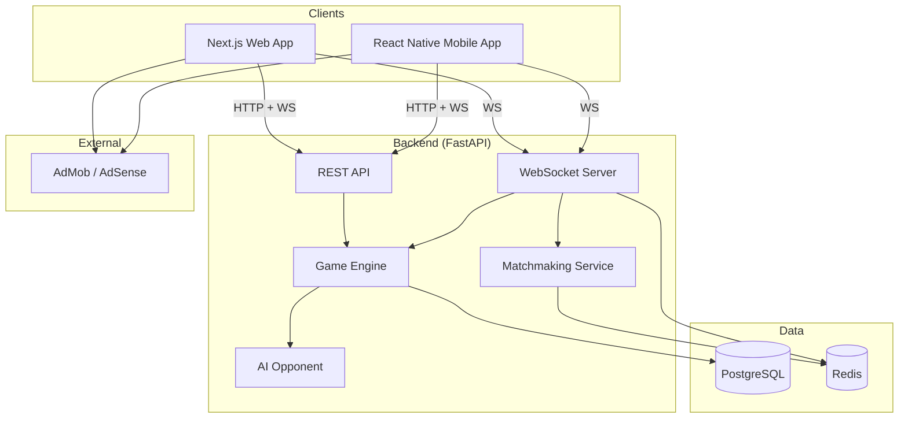
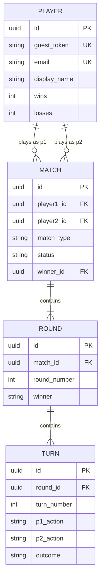
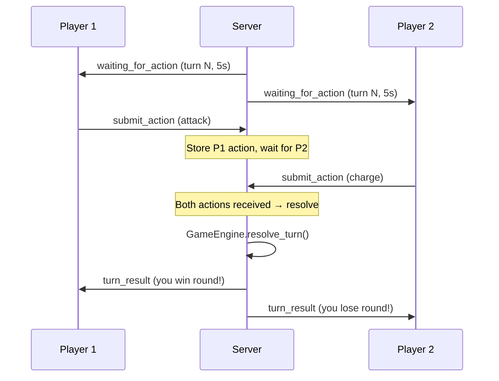

# Ki Clash — Architecture Document

## System Overview



## Module Breakdown

### 1. Game Engine (`app/core/game_engine/`) — `# CORE_CANDIDATE`

**Responsibility:** Pure game logic. Resolves turns, validates actions, determines round/match winners.

**Key interfaces:**
```python
class GameEngine:
    def resolve_turn(self, action_p1: Action, action_p2: Action, state: GameState) -> TurnResult
    def validate_action(self, action: Action, player_ki: int) -> bool
    def check_round_end(self, turn_result: TurnResult, state: GameState) -> RoundResult | None
    def check_match_end(self, round_result: RoundResult, state: GameState) -> MatchResult | None
```

**Composability:** This is a pure state machine. Zero dependencies on HTTP, WebSocket, or database. Any turn-based game can reuse this pattern.

**Key types:**
```python
class Action(str, Enum):
    CHARGE = "charge"
    BLOCK = "block"
    ATTACK = "attack"
    ENERGY_WAVE = "energy_wave"
    TELEPORT = "teleport"

class TurnOutcome(str, Enum):
    P1_WINS_ROUND = "p1_wins_round"
    P2_WINS_ROUND = "p2_wins_round"
    CLASH = "clash"          # both attacked, both lose ki
    BLOCKED = "blocked"      # attack was blocked
    DODGED = "dodged"        # attack was teleported
    NEUTRAL = "neutral"      # no combat happened (e.g., both charged)
```

### 2. AI Opponent (`app/core/ai_opponent/`) — `# CORE_CANDIDATE`

**Responsibility:** Generate actions for AI players. Pure functions, no side effects.

```python
class AIOpponent(Protocol):
    def choose_action(self, difficulty: Difficulty, game_state: GameState, history: list[Turn]) -> Action

class EasyAI(AIOpponent): ...    # Weighted random, bias toward Charge
class MediumAI(AIOpponent): ...  # Pattern matching on last 3 opponent moves
class HardAI(AIOpponent): ...    # Nash equilibrium mixed strategy + adaptation
```

**Composability:** Any game needing AI opponents can implement this protocol with game-specific strategies.

### 3. Matchmaking Service (`app/services/matchmaking.py`)

**Responsibility:** Queue players, pair them, create game sessions.

**Flow:**
```
Player connects WS → joins Redis queue → service polls queue →
pairs 2 players → creates GameState in DB → notifies both via WS
```

**Implementation:**
- Redis sorted set (score = queue join timestamp) for FIFO matching
- Polling interval: 500ms
- Timeout: 30s → offer AI match fallback
- Future: add ELO score to sorted set for skill-based matching

### 4. WebSocket Manager (`app/core/ws_manager/`) — `# CORE_CANDIDATE`

**Responsibility:** Manage WebSocket connections, rooms, and message broadcasting.

```python
class WSManager:
    async def connect(self, websocket: WebSocket, room_id: str, player_id: str)
    async def disconnect(self, player_id: str)
    async def send_to_player(self, player_id: str, message: WSMessage)
    async def broadcast_to_room(self, room_id: str, message: WSMessage)
```

**Scalability note:** For MVP (single server), in-memory connection tracking is fine. For scale, Redis pub/sub handles cross-server messaging (already in place for matchmaking).

**Composability:** Generic WebSocket room manager — reusable for any real-time multiplayer product.

### 5. Auth (`app/core/auth/`) — `# CORE_CANDIDATE`

**Responsibility:** Guest-first authentication with optional upgrade to registered account.

**Flow:**
```
First visit → auto-create guest (UUID + JWT) → play immediately
Optional → register email/password → link to existing guest account
```

- Guest accounts persist stats and match history
- JWT with 7-day expiry, refresh token with 30-day expiry
- Guest accounts auto-expire after 90 days of inactivity

### 6. REST API (`app/api/v1/`)

**Responsibility:** HTTP endpoints for game creation, player profiles, match history.

Follows CLAUDE.md conventions: kebab-case paths, versioned, Pydantic validation on all boundaries, consistent error format.

### 7. Ad Integration (Client-side only)

**Responsibility:** Display ads at appropriate moments. Entirely client-side — backend has no ad logic.

- Web: Google AdSense (banner on lobby, interstitial between matches)
- Mobile: Google AdMob (same placements)
- Shared logic: `useAdTiming()` hook that tracks match completion and triggers interstitials

---

## Database Schema

### Tables

```sql
-- Players
CREATE TABLE players (
    id UUID PRIMARY KEY DEFAULT gen_random_uuid(),
    guest_token VARCHAR(255) UNIQUE,          -- for guest accounts
    email VARCHAR(255) UNIQUE,                 -- null for guests
    password_hash VARCHAR(255),                -- null for guests
    display_name VARCHAR(50) NOT NULL,         -- auto-generated for guests
    wins INT DEFAULT 0,
    losses INT DEFAULT 0,
    draws INT DEFAULT 0,
    created_at TIMESTAMPTZ DEFAULT now(),
    last_active_at TIMESTAMPTZ DEFAULT now()
);

-- Matches (best of 3)
CREATE TABLE matches (
    id UUID PRIMARY KEY DEFAULT gen_random_uuid(),
    player1_id UUID REFERENCES players(id),
    player2_id UUID REFERENCES players(id),    -- null for AI matches
    match_type VARCHAR(20) NOT NULL,            -- 'ai_easy', 'ai_medium', 'ai_hard', 'pvp'
    status VARCHAR(20) DEFAULT 'in_progress',   -- 'in_progress', 'completed', 'abandoned'
    winner_id UUID REFERENCES players(id),      -- null if draw or in-progress
    rounds_won_p1 INT DEFAULT 0,
    rounds_won_p2 INT DEFAULT 0,
    created_at TIMESTAMPTZ DEFAULT now(),
    completed_at TIMESTAMPTZ
);

-- Rounds (within a match)
CREATE TABLE rounds (
    id UUID PRIMARY KEY DEFAULT gen_random_uuid(),
    match_id UUID REFERENCES matches(id) ON DELETE CASCADE,
    round_number INT NOT NULL,                  -- 1, 2, or 3
    winner VARCHAR(10),                         -- 'p1', 'p2', 'draw', null if in-progress
    total_turns INT DEFAULT 0,
    created_at TIMESTAMPTZ DEFAULT now()
);

-- Turns (within a round)
CREATE TABLE turns (
    id UUID PRIMARY KEY DEFAULT gen_random_uuid(),
    round_id UUID REFERENCES rounds(id) ON DELETE CASCADE,
    turn_number INT NOT NULL,
    p1_action VARCHAR(20) NOT NULL,
    p2_action VARCHAR(20) NOT NULL,
    p1_ki_before INT NOT NULL,
    p2_ki_before INT NOT NULL,
    p1_ki_after INT NOT NULL,
    p2_ki_after INT NOT NULL,
    outcome VARCHAR(20) NOT NULL,               -- from TurnOutcome enum
    created_at TIMESTAMPTZ DEFAULT now()
);

-- Indexes
CREATE INDEX idx_matches_player1 ON matches(player1_id);
CREATE INDEX idx_matches_player2 ON matches(player2_id);
CREATE INDEX idx_matches_status ON matches(status);
CREATE INDEX idx_rounds_match ON rounds(match_id);
CREATE INDEX idx_turns_round ON turns(round_id);
```

### Entity Relationships



---

## Real-Time PvP Architecture

### WebSocket Message Protocol

```typescript
// Client → Server
type ClientMessage =
    | { type: "join_queue" }
    | { type: "leave_queue" }
    | { type: "submit_action"; game_id: string; action: Action }
    | { type: "ping" }

// Server → Client
type ServerMessage =
    | { type: "queue_joined"; position: number }
    | { type: "match_found"; game_id: string; opponent: PlayerInfo }
    | { type: "waiting_for_action"; turn: number; time_limit: number }
    | { type: "turn_result"; result: TurnResult }
    | { type: "round_result"; result: RoundResult }
    | { type: "match_result"; result: MatchResult }
    | { type: "opponent_disconnected"; reconnect_timeout: number }
    | { type: "opponent_reconnected" }
    | { type: "pong" }
```

### Turn Flow (PvP)



### Anti-Cheat: Action Commit-Reveal
- Server stores each action with a server-side timestamp
- Neither player's action is sent to the other until BOTH are received
- If time expires, default to "Charge" (least harmful default)
- All actions are final — no take-backs after submission

---

## External Service Integrations

| Service | Purpose | Integration Point |
|---|---|---|
| Google AdSense | Web banner + interstitial ads | Client-side SDK (Next.js) |
| Google AdMob | Mobile banner + interstitial ads | Client-side SDK (React Native) |
| Railway | Backend + Redis hosting | Docker deploy via GitHub Actions |
| Vercel | Next.js web hosting | Git push deploy |

**Note:** No payment integration for MVP (ads-only revenue). Stripe integration deferred to P1 (ad-free pass, cosmetics).

---

## CORE_CANDIDATE Modules

These modules are designed for reuse across the AI Product Factory:

| Module | Path | Reuse Scenario |
|---|---|---|
| Game Engine | `app/core/game_engine/` | Any turn-based simultaneous-action game |
| WebSocket Manager | `app/core/ws_manager/` | Any real-time multiplayer product |
| Auth (Guest-first) | `app/core/auth/` | Any product wanting zero-friction onboarding |
| AI Opponent Protocol | `app/core/ai_opponent/` | Any game with AI opponents |

---

## Composability Notes

1. **Game Engine** is a pure state machine. To build a new game: implement a new `OutcomeMatrix` and `Action` enum. The turn/round/match lifecycle is identical.

2. **WebSocket Manager** handles rooms and broadcasting generically. Not coupled to game concepts — could power a chat room, live auction, or collaborative editor.

3. **Guest-first Auth** is the pattern for all consumer products. Users play immediately, register only when they want to persist progress. This module snaps into any product.

4. **The Turn Protocol** (submit action → wait for opponent → resolve → broadcast) is a reusable pattern. Extract it as `TurnBasedGameProtocol` for future products.

---

## Project Structure (Ki Clash Specific)

```
ki-clash/
├── app/
│   ├── main.py
│   ├── config.py
│   ├── dependencies.py
│   ├── api/v1/
│   │   ├── router.py
│   │   └── endpoints/
│   │       ├── auth.py
│   │       ├── games.py
│   │       └── players.py
│   ├── core/                          # CORE_CANDIDATE modules
│   │   ├── auth/
│   │   │   ├── __init__.py
│   │   │   ├── jwt_handler.py
│   │   │   └── guest_auth.py
│   │   ├── game_engine/
│   │   │   ├── __init__.py
│   │   │   ├── engine.py             # Turn resolution logic
│   │   │   ├── outcome_matrix.py     # Action vs Action results
│   │   │   └── types.py             # Action, TurnResult, etc.
│   │   ├── ai_opponent/
│   │   │   ├── __init__.py
│   │   │   ├── base.py              # Protocol definition
│   │   │   ├── easy.py
│   │   │   ├── medium.py
│   │   │   └── hard.py
│   │   └── ws_manager/
│   │       ├── __init__.py
│   │       └── manager.py
│   ├── modules/                       # Ki Clash-specific
│   │   └── ki_clash/
│   │       ├── matchmaking.py
│   │       └── game_session.py
│   ├── models/
│   │   ├── player.py
│   │   ├── match.py
│   │   ├── round.py
│   │   └── turn.py
│   ├── schemas/
│   │   ├── auth.py
│   │   ├── game.py
│   │   └── player.py
│   └── services/
│       ├── game_service.py
│       ├── matchmaking_service.py
│       └── player_service.py
├── web/                               # Next.js frontend
│   ├── src/
│   │   ├── app/
│   │   ├── components/
│   │   │   ├── GameBoard.tsx
│   │   │   ├── ActionCard.tsx
│   │   │   ├── KiMeter.tsx
│   │   │   ├── CountdownTimer.tsx
│   │   │   ├── TurnReveal.tsx
│   │   │   └── MatchHUD.tsx
│   │   ├── hooks/
│   │   │   ├── useGameWebSocket.ts
│   │   │   ├── useMatchmaking.ts
│   │   │   └── useAdTiming.ts
│   │   └── lib/
│   │       ├── gameApi.ts
│   │       └── wsClient.ts
│   └── package.json
├── mobile/                            # React Native (Expo)
│   ├── src/
│   │   ├── screens/
│   │   ├── components/               # Shared component logic, native UI
│   │   └── hooks/                    # Same hooks as web where possible
│   └── package.json
├── tests/
├── alembic/
├── docs/
│   ├── spec.md
│   └── architecture.md
├── CLAUDE.md
├── pyproject.toml
└── Dockerfile
```
